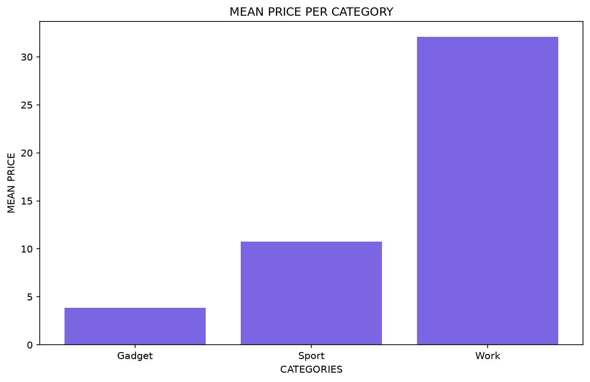
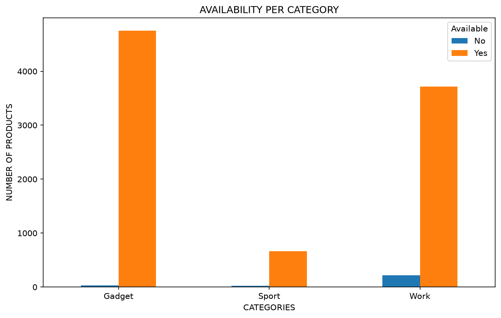

# GedShop Multi-Category Scraper


Automated data collection pipeline that turns an entire product catalog into structured, analysis-ready data — no manual copy-pasting, no hours spent browsing pages by hand.

This project simulates a real business need: keeping track of a large, multi-category product catalog (pricing, availability, product range) without manually checking hundreds of pages. Built on **gedshop.it**, an Italian e-commerce site, it collects and processes data across three categories — Workwear, Sport, and Gadget — roughly **10,000 products** in total.

## Why this matters for a business

Manually monitoring a catalog of this size — checking prices, spotting out-of-stock items, comparing categories — would take a person many hours, and the data would be outdated as soon as it's collected. This pipeline does it automatically, end to end:

- **Time saved**: a full re-scrape of ~10,000 products runs unattended, replacing what would otherwise be hours of manual browsing and data entry.
- **Always structured**: raw pages become a clean, ready-to-use spreadsheet — no manual formatting.
- **Repeatable**: run it again next week or next month to track price and availability changes over time.
- **Extensible**: the same approach adapts to competitor monitoring, supplier catalog audits, or lead generation on any similarly structured site.

## What it does

1. **Scrape** — a single, parametrized Scrapy spider collects product name, price, item code, material and description across all pages of each category, handling pagination automatically.
2. **Clean** — a pandas pipeline validates and fixes the data: type conversion, price parsing, duplicate and missing-value checks.
3. **Merge & export** — categories are combined into one dataset (with a `Category` column for easy filtering/grouping) and exported to a multi-sheet Excel file: one combined sheet plus one per category.
4. **Analyze** — exploratory analysis with visualizations: average price per category, and product availability per category.

## Visualizations

**Average price per category**



**Product availability per category** (based on missing price = out of stock)



Both charts are generated live in `cleaning_ecom.ipynb`.

## Project structure

```
gedshop/
├── gedshop/                # Scrapy project (spider, settings, config)
│   └── spiders/shop.py
├── cleaning_ecom.ipynb      # Cleaning & analysis notebook (with outputs)
├── script_clean.py          # Script version of the cleaning pipeline
├── config_ecom_scraper.py   # Category URL configuration
├── images/                  # Exported chart images
├── samples_data.xlsx        # Small sample of the final dataset
└── scrapy.cfg
```

## Note on data

The full scraped dataset (~10,000 products) is not included in this repository, in line with the source site's data usage policy. A small sample (`samples_data.xlsx`, a few rows per category) is included to show the data structure. The full pipeline output — row counts, data quality checks, and charts — is visible directly in `cleaning_ecom.ipynb`.

## Tech stack

Python, Scrapy, pandas, matplotlib, openpyxl

## How to run

```bash
cd gedshop
python -m scrapy crawl shop -a category=gadget -O gadget.json
python -m scrapy crawl shop -a category=work -O work.json
python -m scrapy crawl shop -a category=sport -O sport.json
```

Then run `cleaning_ecom.ipynb` (or `script_clean.py`) to clean, merge and export the data.
